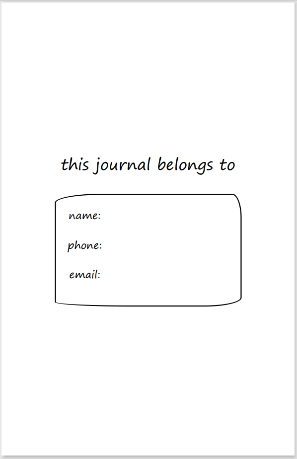

# About

This is a template that you can use to make a dot grid journal typeset of any size, with any margins, with any spacing between the dots, with any number of pages, with page numbers or without page numbers (using any font you like), with a little nameplate at the front or without one, and with your own bindery name and logo easily included. And, it works on Windows, Mac, and Linux, using entirely free software.

You will need to use the command line, and edit some code files. Shh. It's okay. I am holding out my hand to you. You can do this. Ready?

# Instructions

### Download the files

- click on the "Code" button on this github page and select "Download ZIP"
- unzip the folder you just downloaded and open it up

### Customize the journal

- you will need a text editor to read and edit the code files. you can use the default pre-installed one if you like - notepad on windows, or textedit on mac
- open the "icons" folder
    - admire my 5-minute fake logo graphic. so beautiful, I could cry. ok, delete it now.
    - put your bindery logo file in the "icons" folder and rename it to "logo"
    - if you don't have a logo or it's not an svg, see the comment near the bottom of dotjournal.html to adjust the template
- at the top of style.css, change the font and/or font size (unless you plan to do plain dots only, in which case it's not necessary)
- inside script.js, go to the section between the two dashed lines and change any values you want (particularly the bindery name, if you don't want it to be Example Books)
- optionally make any other changes - feel free to play around. you can always go back to the original code from github if you mess something up.

### Install the required tools

- install [git](https://git-scm.com/downloads) (make sure to get git bash and enable the context menu actions)
- install [node.js](https://nodejs.org/en/) (the basic installation is fine)
- in a command prompt or terminal window, run `npm install -g pagedjs-cli pagedjs` to install paged.js
- in a command prompt or terminal window, run `npm install -g http-server` (required for browser preview)

### Get a command prompt at the correct location

- open a command prompt or terminal window at the folder path where dotjournal.html is located
- if you have git bash configured as described above, you should be able to right-click inside the folder and select "Git Bash Here" to accomplish this

### Preview in browser (optional)

- type `http-server` in your new terminal window and hit enter
- go to the url it tells you (probably `http://127.0.0.1:8080`)
- click the "dotjournal.html" link
- this will give you a preview of what the pdf will look like - any changes you make to the code will be reflected when you refresh the page
- when you're done, hit ctrl+c in your terminal window to stop the local server

### Generate pdf

- open dotjournal.html in your text editor and delete or comment out the two lines near the top as instructed - those are for the browser preview only, and the command line tool will get confused and not work if you leave them in
- run `pagedjs-cli dotjournal.html -o dotjournal.pdf -w 139.7 -h 215.9` in your terminal window
    - `-w` and `-h` must be set to the same width and height you set in the javascript file *in millimeters*
        - the above is 5.5in x 8.5in, if you're doing half-letter
        - however, if you're using a standard paper size, you can also replace `-w 139.7 -h 215.9` with `-s {paper size}`
        - so for half-letter, you can do `-s statement`, or for A5, you can do `-s A5`
- this will create a file called dotjournal.pdf (in the same folder with the code)
- run dotjournal.pdf through [bookbinder-js](https://momijizukamori.github.io/bookbinder-js/) to format it into signatures for print
- that's it! you did it!

### Screenshots

Here's an example of what the journal will look like (please excuse the crappy system font)

 ### Note
 
 This template was made for members of the Renegade Bindery discord server. Anyone is allowed to use it, but you may wish to remove the references to Renegade Bindery if you are not part of that group. You can easily do this by deleting `

` and `` from dotjournal.html.
